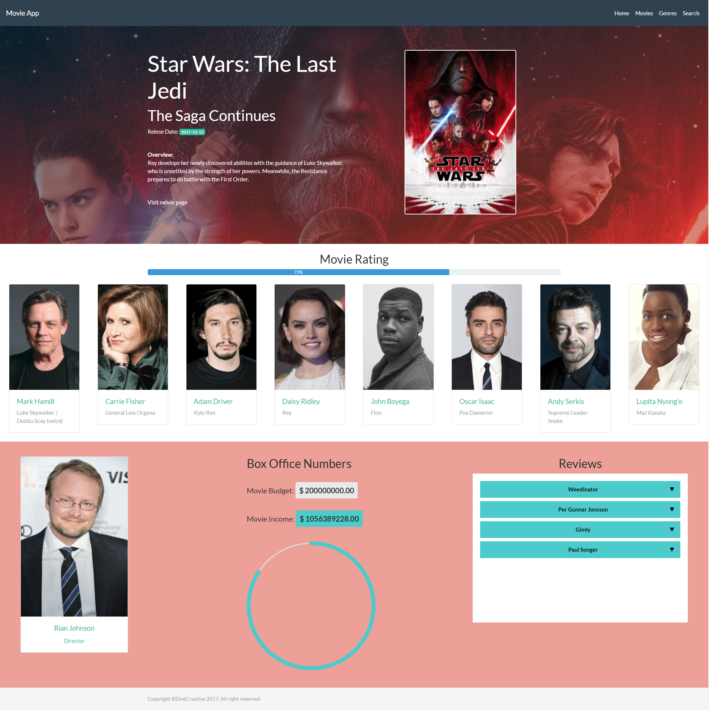

# Movie Place
[Visit App](https://drejcreative.github.io/movie-place-React/)

This is React one page app for searching movies, watching trailers, and getting all related informations about movies. It is react build of my already existing [Angular 4 app](https://github.com/drejcreative/movie-place). Frontend is build by React V16 and backend informations come from `themoviedb.org` free API.

This project was generated with [create-react-app](https://github.com/facebookincubator/create-react-app)

## Development server
Run `npm start` for a dev server.

## Build
Run `npm build-js` to build the project. The build artifacts will be stored in the `dist/` directory. Use the `-prod` flag for a production build.
